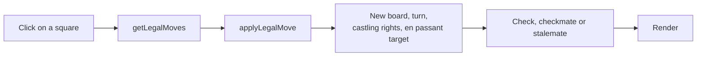

# Chess (React + TypeScript)

Two-player chess in the browser with all the standard rules, written without chess libraries.

> **Context:** pet project to practise React and TypeScript on something with real rules to get right. React 19, TypeScript, Vite. 2026.

<!-- Add a screenshot here:  -->

## Features

- 8×8 board with the standard starting position; legal moves are highlighted when you pick a piece.
- Moves for every piece, with legality checks: a move that leaves your own king in check is not allowed.
- Check, checkmate and stalemate detection.
- Castling, en passant and pawn promotion with a choice of piece.
- New game button.

## Tech stack

| Layer | Technology |
| --- | --- |
| UI | React 19, CSS |
| Language and tooling | TypeScript 5.9, Vite 7, ESLint |
| Deployment | Docker, Nginx |

## Architecture

The rules live in `src/chess.ts` as pure functions with no React code. `App.tsx` only keeps the game state and renders it, so the rules can be tested and reused on their own.



How a move is validated:

1. The board is a typed 8×8 array: `Board = BoardCell[][]`.
2. For the selected piece the engine generates pseudo-legal moves: moves that follow the piece's pattern but may leave the king in check.
3. Each candidate is played on a copy of the board. If the own king ends up attacked, the move is dropped.
4. After a real move the engine updates the turn, castling rights and the en passant target square.
5. The game state comes from two questions: is the side to move in check, and does it have any legal move? No moves plus check is checkmate; no moves without check is stalemate.

## Project structure

```text
frontend/
  src/
    chess.ts    rules: move generation, legality, check detection, castling, en passant, promotion
    App.tsx     game state and board rendering
    App.css     board and piece styles
  Dockerfile    production build served by Nginx
docker-compose.yml
```

## Getting started

```bash
cd frontend
npm install
npm run dev      # http://localhost:5173
```

With Docker, from the project root:

```bash
docker compose up --build    # http://localhost:8080
```

## What I'd improve next

- Unit tests for `chess.ts` with Vitest, including perft counts (the number of legal positions after N moves) to check move generation.
- Move history in algebraic notation and undo.
- Draw rules: threefold repetition, the fifty-move rule and insufficient material.
- A simple computer opponent based on minimax.

## License

MIT
